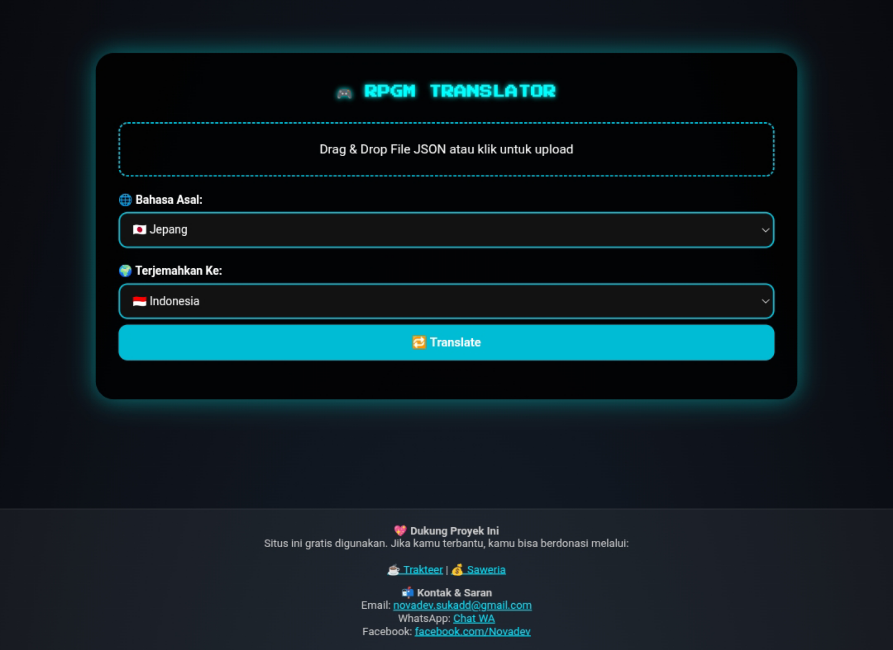
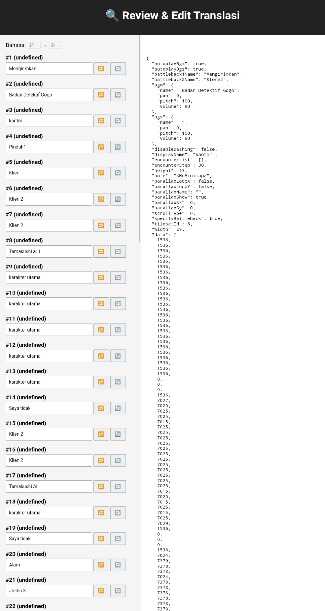
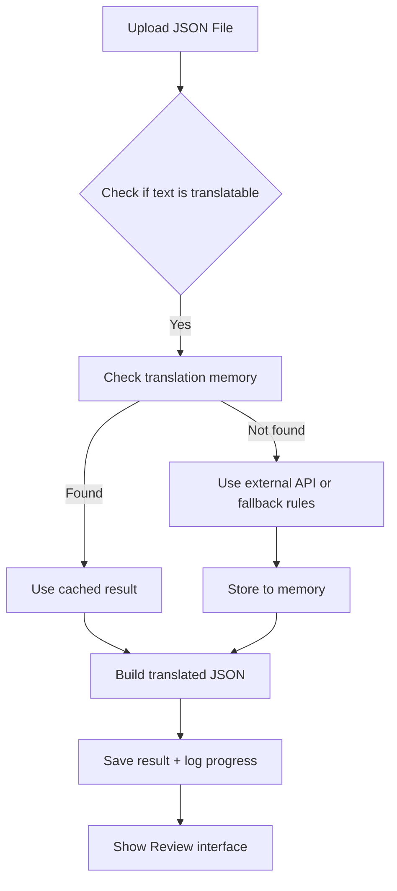

# 🌐 RPG Maker JSON Translator Web Tool

[](https://opensource.org/licenses/MIT)


A web-based translator for `.json` files — primarily designed for **RPG Maker** games — with smart caching, review mode, progress tracking, and modular translation memory. Built for developers, localizers, and translators working on game dialogue or structured data in JSON format.

---

## 📦 Table of Contents

- [Features](#-features)
- [Demo](#-demo)
- [Getting Started](#-getting-started)
- [Folder Structure](#-folder-structure)
- [Translation Flow](#-translation-flow)
- [Contributing](#-contributing)
- [License](#-license)
- [Contact](#-contact)

---

## 🚀 Features

- ✅ Drag & Drop JSON file support
- ✅ Auto translation via memory & external APIs (if enabled)
- ✅ Review and re-translate line-by-line
- ✅ Skips non-translatable content (numbers, empty strings, etc.)
- ✅ Progress tracking per file & user session
- ✅ Translation memory stored persistently
- ✅ Full client-server separation (HTML + PHP)

---

## 🎬 Demo

Here’s a quick look at the interface and workflow:



Riview Mode



---

## 🛠️ Getting Started

### Requirements

- PHP 7.4 or later
- Web server (e.g. XAMPP, Laragon, Apache, Nginx)

### Installation

1. Clone or download this repository.
2. Move it to your web server root (e.g., `htdocs/`).
3. Access `index.html` from your browser.
4. You're ready to go!

### File Upload & Translation

- Upload your `.json` file using the provided drag-and-drop UI.
- Select source and target languages (e.g. `ja → en`).
- Click `Translate`.
- Use `Review` to manually inspect and fine-tune translations.
- Download the translated JSON once you're done.

---

## 🗂️ Folder Structure

```
/uploads                  ← Temporary storage for uploaded JSON files
/logs                     ← Stores progress logs per filename
index.html                ← Main frontend UI
translate.php             ← Main backend handler
rules.json                ← Optional rules for custom translation logic
wordbank.json             ← Custom user-defined translations
translation_memory.json   ← Cache for previously translated phrases
```

---

## 🔄 Translation Flow



> *Note: Mermaid flowchart may only render on supported markdown renderers (e.g. GitHub).*

---

## 💡 Contributing

We welcome contributions from the community. Whether it's fixing bugs, adding features, or improving documentation — every bit helps!

### To contribute:

1. Fork this repository
2. Create a new branch (`git checkout -b feature/YourFeature`)
3. Commit your changes
4. Push to your branch (`git push origin feature/YourFeature`)
5. Open a Pull Request

Please check the open issues or submit a new one if you spot a bug or have a feature request.

---

## 📄 License

Licensed under the **MIT License**.  
You are free to use, modify, and distribute this software with proper credit to the original author.

---

## 🙌 Contributors

This project is built with passion — and is always open for improvements.

We're excited to grow this tool with the help of developers, translators, and creatives from around the world.


---

## 🏆 Contributors Wall

| Name         | Role                   | Status     |
|--------------|------------------------|------------|
| Nova Ardian  | Creator & Maintainer   | ⭐ Active   |
| 🤔 Your Name? | Contributor             | 🔓 Waiting... |

Want your name here? Start contributing by [opening an issue](https://github.com/novagannn/rpgm-translation-tool/issues) or sending a pull request.

---

## 📬 Contact

Have questions, ideas, or collaboration offers?

- GitHub Issues: [Submit here](https://github.com/novagannn/rpgm-translation-tool/issues)
- GitHub Profile: [@novagannn](https://github.com/novagannn)
- Email: [nova.ardian.dev@gmail.com](mailto:you@example.com)

---

> _"Translation is not just about language — it's about bridging understanding."_
